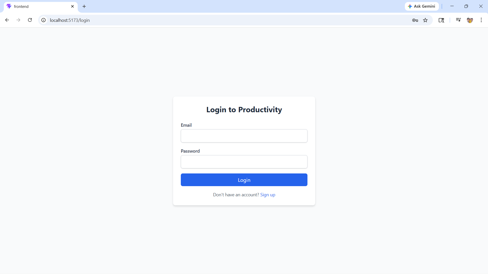
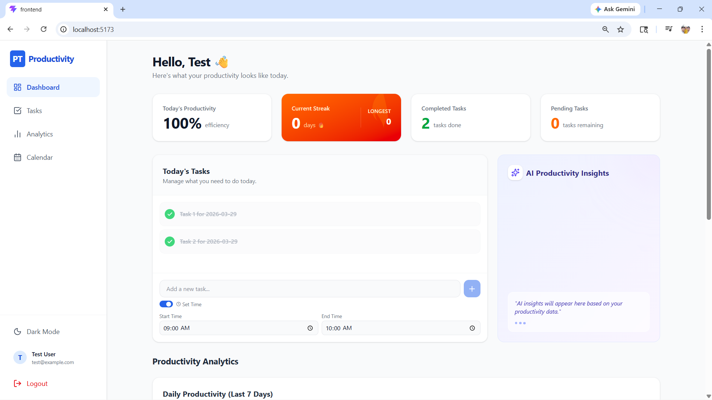
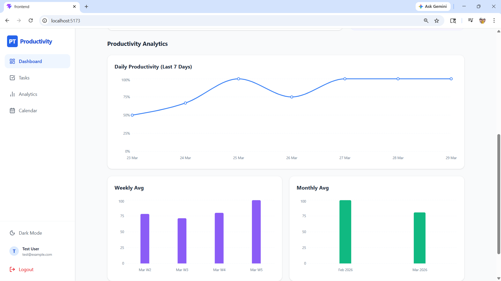
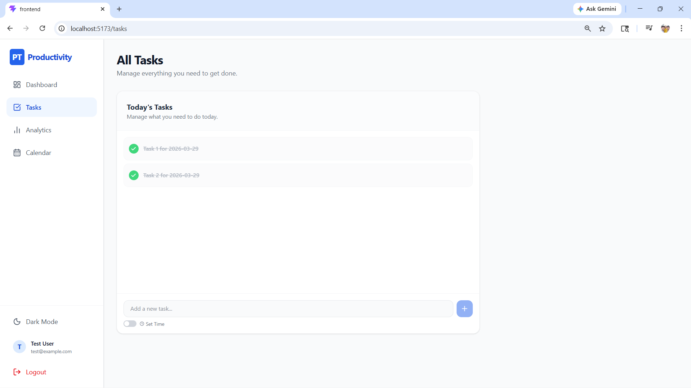
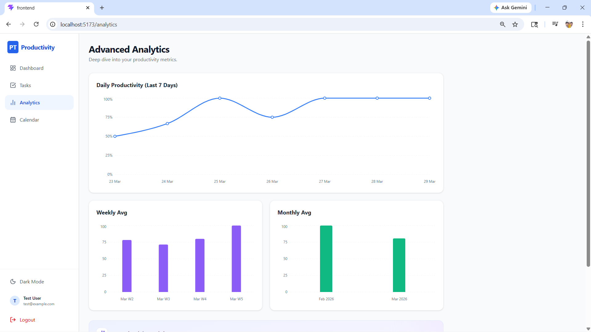

# Productivity Tracker

A full-stack MERN productivity tracker that helps users manage tasks, track streaks, and visualize productivity through daily, weekly, and monthly analytics.

## Tech Stack

- MongoDB

- Express.js

- React.js

- Node.js

## Features

- User authentication

- Task management

- Dashboard with charts

- Calendar and streak tracking

- Weekly and monthly analytics

- AI insights section

## In Progress

- Better UI improvements

- More advanced analytics

- Deployment

## How to Run

### Backend

cd backend

npm install

npm start

### Frontend

cd frontend

npm install

npm run dev

## Screenshots

### Login Page

### Dashboard

### Dashboard scroll

### Task Manager

### Analytics Page

